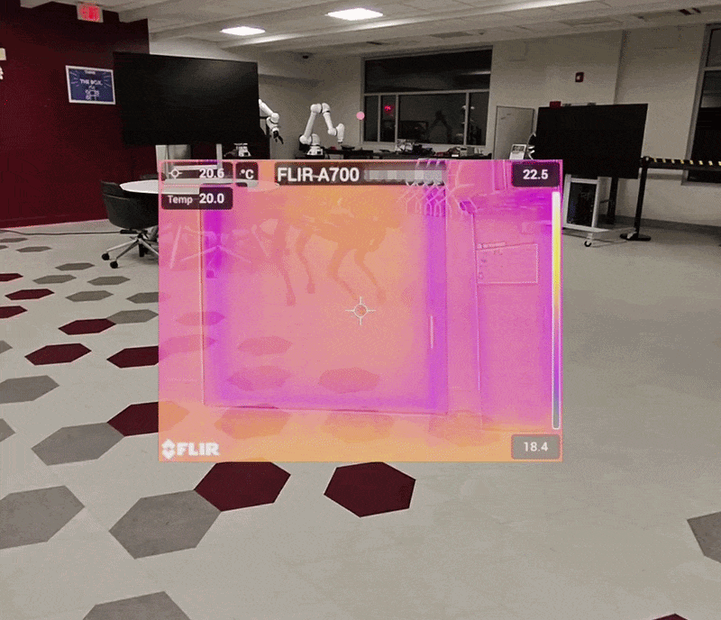
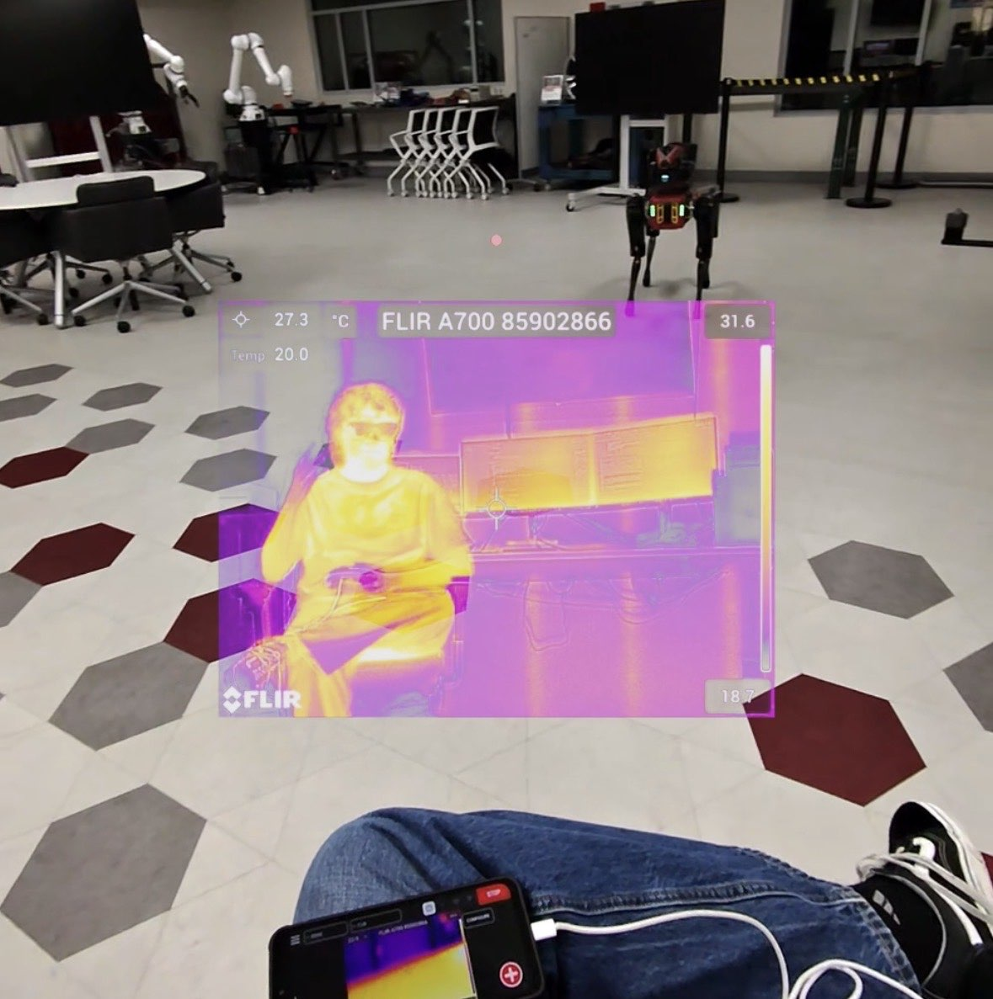
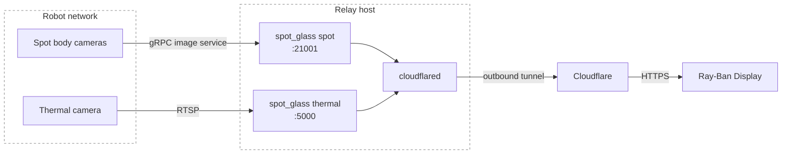

# Spot Glass

Streams Boston Dynamics Spot camera feeds to the browser as MJPEG, optionally
through a Cloudflare tunnel. The viewer page targets the Meta Ray-Ban Display
(600×600).

<p align="center">
  
  
</p>

Two sources are supported:

- **`spot`**: Spot's body cameras, read through the robot's authenticated
  image service. The two front cameras are de-rotated and stitched into a
  single panorama.
- **`thermal`**: an RTSP payload camera.

## How it works



Each relay holds a connection to its camera in a background thread, keeps
only the newest frame, and serves it as MJPEG. cloudflared connects out to
Cloudflare, so no inbound ports are opened. It sends requests for `/spot/*`
to the Spot relay and everything else to the thermal relay.

## Setup

Requires Python 3.10+, plus [`cloudflared`](https://developers.cloudflare.com/cloudflare-one/connections/connect-networks/downloads/)
if you use the tunnel.

```bash
python -m venv .venv
.venv/Scripts/pip install -r requirements.txt   # .venv/bin/pip on macOS/Linux
cp .env.example .env
```

## Usage

```bash
python -m spot_glass spot --tunnel   # Spot cameras, plus the Cloudflare tunnel
python -m spot_glass thermal         # thermal camera
```

| Source      | Local viewer                         | Behind the tunnel                       |
| ----------- | ------------------------------------ | --------------------------------------- |
| `spot`    | `http://localhost:21001/spot/view` | `https://<STREAM_HOSTNAME>/spot/view` |
| `thermal` | `http://localhost:5000/view`       | `https://<STREAM_HOSTNAME>/view`      |

If Spot credentials are missing, the relay prompts for them. `--tunnel` runs
`cloudflared tunnel run $CLOUDFLARE_TUNNEL` and stops it when the relay exits.
Both relays can share one hostname: in `~/.cloudflared/config.yml`, route
`/spot/*` to `:21001` *before* the catch-all route to `:5000`.

To view on the glasses, enable Developer Mode, then go to **Settings → App
connections → Add a Web App** and enter the viewer URL.

### Endpoints

Every route is served both bare and under the source's prefix (`/spot` for Spot).

| Path          |                                                                                     |
| ------------- | ----------------------------------------------------------------------------------- |
| `/view`     | Viewer page. Falls back from MJPEG to snapshot polling if the stream doesn't render |
| `/stream`   | MJPEG stream                                                                        |
| `/snapshot` | Latest JPEG                                                                         |
| `/healthz`  | `200` if a frame arrived in the last 10 s, otherwise `503`                      |

## Configuration

Settings come from environment variables or `.env`.

| Variable                                   | Default                       |                                                                         |
| ------------------------------------------ | ----------------------------- | ----------------------------------------------------------------------- |
| `SPOT_HOSTNAME`                          | `192.168.80.3`              | Robot address                                                           |
| `SPOT_CAMERA`                            | `front`                     | `front`, `frontleft`, `frontright`, `back`, `left`, `right` |
| `BOSDYN_CLIENT_USERNAME` / `_PASSWORD` |                               | Robot credentials                                                       |
| `CAPTURE_FPS`                            | `10`                        | Spot polling rate                                                       |
| `CROP`                                   | `1`                         | Trim the black corners left by de-rotation                              |
| `RTSP_URL`                               | `rtsp://192.168.80.102/avc` | Thermal camera                                                          |
| `TARGET_FPS`                             | `10`                        | Output frame rate                                                       |
| `JPEG_QUALITY`                           | `60`                        | 0–100                                                                  |
| `MAX_WIDTH`                              | `480`                       | Downscale wider frames                                                  |
| `LISTEN_HOST`                            | `127.0.0.1`                 |                                                                         |
| `LISTEN_PORT`                            | `21001` / `5000`          |                                                                         |
| `URL_PREFIX`                             | `/spot` / *(none)*        |                                                                         |
| `CLOUDFLARE_TUNNEL`                      |                               | Tunnel name for`--tunnel`                                             |
| `STREAM_HOSTNAME`                        |                               | Public hostname (used only to print the URL)                            |

## Project layout

```
spot_glass/
  __main__.py   command-line interface
  capture.py    frame buffer and reconnecting capture loop
  server.py     Flask routes
  viewer.html   viewer page
  spot.py       Spot image-service source
  imaging.py    de-rotation, cropping, stitching
  rtsp.py       RTSP source
  tunnel.py     cloudflared process
spot-extension/ thermal relay packaged as a Spot CORE I/O Extension
```

To add a camera, write a class with `label`, `poll_interval`, `connect()`,
`read()`, `close()` and `info()`, then register it in `__main__.py`.

## Security

> [!WARNING]
> A tunnel hostname is public: anyone with the URL can watch the feed. Put it
> behind [Cloudflare Access](https://developers.cloudflare.com/cloudflare-one/applications/)
> before deploying for real.
