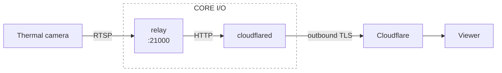

# CORE I/O Extension

Packages the thermal relay (`python -m spot_glass thermal`) with a cloudflared
container as a Spot CORE I/O Extension.



The relay publishes no ports. cloudflared reaches it over the private compose
network and connects out to Cloudflare, so the robot network needs no inbound
rules. The relay listens on `21000`, inside CORE I/O's payload range
(21000–22000; 21443 is reserved).

## Build

```bash
./build_spx.sh
```

You need Docker with buildx. arm64 is emulated, so a Jetson is not required.
The script copies `../spot_glass` into the build context and bundles both
images into `spot_thermal_relay.spx`, so the robot needs no internet access at
install time. If you run `docker compose build` directly, copy `../spot_glass`
here first.

## Cloudflare tunnel

1. In the Zero Trust dashboard, go to **Networks → Tunnels → Create a tunnel**
   and choose **Cloudflared**.
2. Copy the tunnel token.
3. Add a public hostname with service `HTTP` → `relay:21000`.

The viewer will be at `https://<hostname>/view`. Put the hostname behind
Cloudflare Access unless the feed is meant to be public. Note that video
leaves the robot network and passes through Cloudflare.

## Install

In the CORE I/O web portal, go to **Extensions → Upload New Extension**, upload
the `.spx`, and set `TUNNEL_TOKEN` and `RTSP_URL` in the environment config
(see `.env.example`). The other settings (`TARGET_FPS`, `JPEG_QUALITY`,
`MAX_WIDTH`) are described in the main README.
